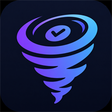

<div align="center">
  
  <h1>Todonado</h1>
  <p><strong>Your daily command center.</strong> Capture everything. Plan a realistic day. Execute with focus. Recover intelligently.</p>
</div>

---

Todonado is a dark, **mission-control daily command center** for tasks, projects, and focus —
**not** another to-do list. Its core differentiator is **effort-aware day planning**: tag
tasks with an effort estimate and the **Today capacity meter** keeps your day honest, with
lightweight roll-over for whatever didn't get done.

> **Status:** MVP task engine working (Phase 1). Capture in the Inbox, organize in Projects
> (sections + subtasks), plan **Today** with a live effort-aware capacity meter + overbooking
> guard, and roll over yesterday's leftovers — all wired to Supabase with optimistic updates
> and realtime sync. Focus & Insights are placeholders (V1). See [`docs/ROADMAP.md`](docs/ROADMAP.md).

## Tech stack
- **Vite + React 18 + TypeScript (strict)**
- **Tailwind CSS v3** (locked dark design tokens)
- **Supabase** — auth + Postgres + Row Level Security + realtime
- **TanStack Query** — all server state / caching
- **React Router v6**, **Zod**, **date-fns**, **lucide-react**

## Project layout
```
src/components/{ui,layout,brand,common}   UI primitives, shell, brandmark, shared bits
src/features/{auth,today,inbox,projects,focus,insights}   feature modules
src/lib            supabase client, env, query client, utils
src/routes         app routing
src/types          database row types
supabase/migrations   schema, RLS, auth bootstrap (SQL)
docs               PRD, ROADMAP
CLAUDE.md          product thesis, design system, conventions, roadmap (read first)
```

## Getting started

### Prerequisites
- Node.js 18+ (developed on Node 24)
- A Supabase project (free tier is fine)

### 1. Install
```bash
npm install
```

### 2. Configure environment
Copy the example file and fill in your Supabase credentials
(Supabase Dashboard → Project Settings → API):
```bash
cp .env.example .env
```
```ini
VITE_SUPABASE_URL=https://YOUR-PROJECT.supabase.co
VITE_SUPABASE_ANON_KEY=YOUR-ANON-PUBLIC-KEY
```
> The app **boots without keys** and shows the login screen with a setup prompt. Sign-in is
> enabled once the keys are present (restart the dev server after editing `.env`).
> Only the public **anon** key belongs in the browser — never commit `.env` or any secret.

### 3. Apply database migrations
The SQL lives in [`supabase/migrations/`](supabase/migrations/) (schema → RLS → auth
bootstrap). Apply it either way:

**A) Supabase SQL Editor (quickest):** open the SQL Editor in your project and run each file
in order:
1. `20260602120000_initial_schema.sql`
2. `20260602120100_rls_policies.sql`
3. `20260602120200_auth_bootstrap.sql`
4. `20260603090000_add_daily_capacity.sql` — adds `profiles.daily_capacity_minutes`
5. `20260603090100_realtime.sql` — adds tables to the realtime publication

**B) Supabase CLI:**
```bash
supabase link --project-ref YOUR-PROJECT-REF
supabase db push
```

This creates the tables, `updated_at` triggers, workspace-isolated RLS, and a trigger that
auto-provisions a profile + default workspace for each new user.

### 4. Run
```bash
npm run dev        # start the dev server (http://localhost:5173)
npm run build      # typecheck + production build
npm run preview    # preview the production build
npm run lint       # eslint
npm run typecheck  # tsc (strict)
npm run test       # vitest (pure logic: capacity, roll-over, selectors, reorder)
```

### 5. (Optional) Seed sample data
Populate Today + the capacity meter with sample projects and tasks:
```bash
npm run seed
```
Requires (in `.env`) `VITE_SUPABASE_URL` plus **either** `SUPABASE_SERVICE_ROLE_KEY`
(server-only secret — never exposed to the browser) **or** `SEED_EMAIL` + `SEED_PASSWORD`
for an existing account. Re-running replaces the seed rows. See `.env.example`.

## PWA
Todonado ships an installable web app manifest (`public/manifest.webmanifest`) with brand
icons and `display: standalone`. Offline support via a service worker is intentionally
deferred (TODO) until after the MVP.

## Contributing / working in this repo
Read **[`CLAUDE.md`](CLAUDE.md)** first — it defines the product thesis, the locked design
system, folder & coding conventions (TS strict, feature-based, TanStack Query for all server
state, RLS-first, no secrets in code), the roadmap, and the explicit **DO NOT BUILD YET**
list. Run typecheck + lint + build before committing.

## License
Private project. All rights reserved.
